# Práctica 1. Catálogo de productos inicial

## Objetivo de la práctica:

Al finalizar esta práctica, el participante será capaz de:
- Crear un archivo de Excel con una hoja estructurada en filas, columnas y celdas.
- Ingresar datos organizados en forma de tabla.
- Renombrar hojas, guardar y duplicar archivos utilizando `Guardar como`.
- Cerrar y reabrir archivos correctamente.

## Objetivo visual

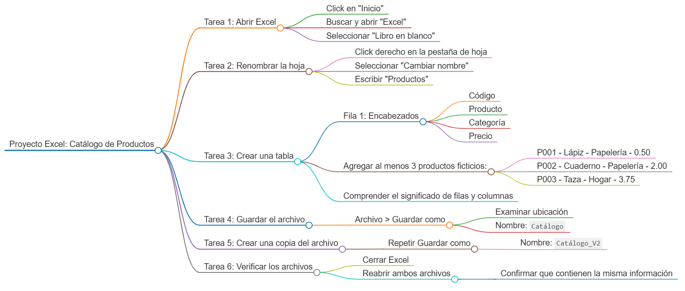

## Duración aproximada:
- 25 minutos.

## Instrucciones 

### Tarea 1. **Abrir Excel**

Paso 1. Dar clic en `Incio` en la barra de tareas. 

Paso 2. Escribir `Excel` y dar clic en el icono de `Excel`.

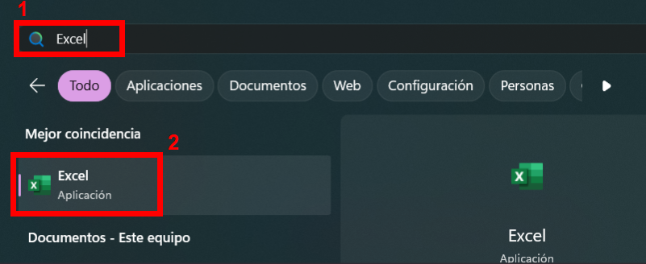

Paso 3. Una vez abierto, seleccionar `Libro en blanco`.

### Tarea 2. **Renombrar la hoja**

Paso 4. Hacer clic derecho sobre la pestaña de la hoja en la parte inferior y seleccionar `Cambiar nombre`.

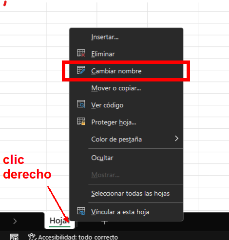

Paso 5. Escribir el nombre `Productos`.

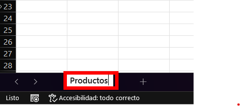

### Tarea 3. **Crear una tabla**

Paso 6. En la fila 1, escribir los siguientes encabezados (una por celda, de izquierda a derecha):

- Código
- Producto
- Categoría
- Precio

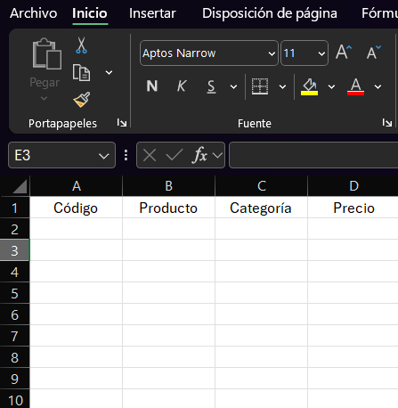

Paso 7. En las filas siguientes (mínimo 3), agregar productos ficticios.

     | Código | Producto     | Categoría     | Precio |
     |--------|--------------|---------------|--------|
     | P001   | Lápiz        | Papelería     | 0.50   |
     | P002   | Cuaderno     | Papelería     | 2.00   |
     | P003   | Taza         | Hogar         | 3.75   |

Paso 8. Identificar mentalmente que representa cada fila y cada columna.

### Tarea 4. **Guardar el archivo**

Paso 9. Hacer clic en `Archivo` en la parte superior derecha.

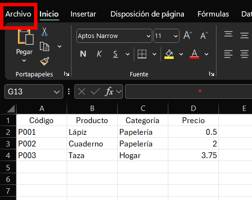

Paso 10. Dar clic en `Guardar como`.

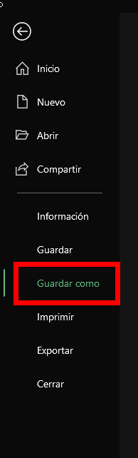

Paso 11. Seleccionar `Examinar`.

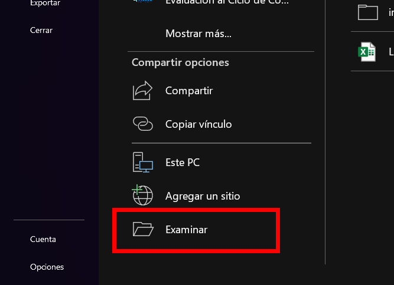

Paso 12. Escoger la carpeta donde sera guardado el archivo de Excel, y colocarle el nombre `Catálogo`.

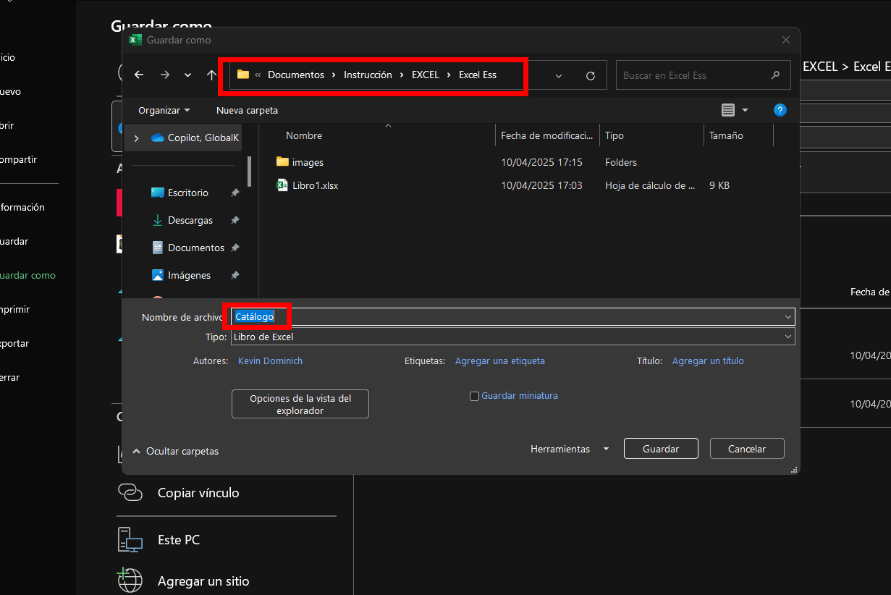

### Tarea 5. **Crear una copia del archivo**

Paso 13. Seguir los pasos del 9 al 11 para usar `Guardar como` nuevamente, pero esta vez guarda el archivo como: `Catálogo_V2`.

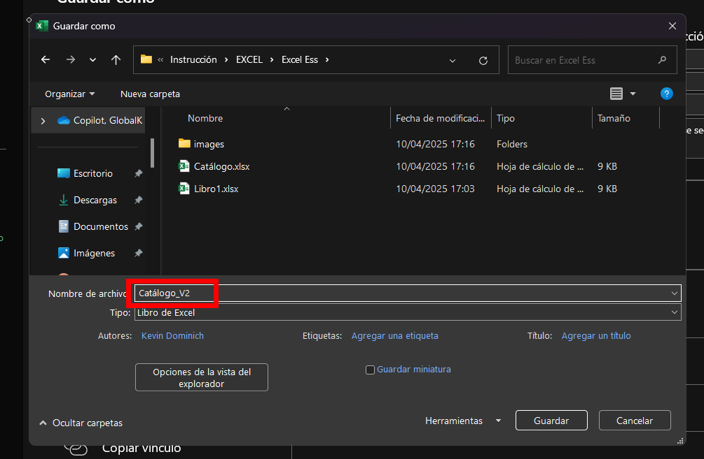

### Tarea 6. **Verificar los archivos**
 
Paso 14. Cerrar Excel completamente.

Paso 15. Reabrir ambos archivos para verificar que ambos tengan la misma tabla y que la información se haya guardado correctamente.

### Resultado esperado
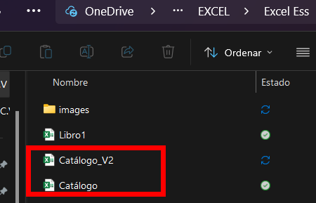

