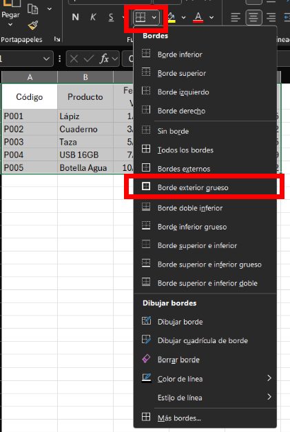

# Práctica 2. Informe de ventas mensuales

## Objetivo de la práctica:

Al finalizar esta práctica, el participante será capaz de:
- Aplicar formatos de celda como moneda, fecha y porcentaje.
- Alinear y agregar bordes a las celdas.
- Usar estilos rápidos, ajustar el ancho y alto de columnas y filas, combinar celdas, y crear un formato personalizado básico en una tabla de ventas.

## Objetivo visual

## Duración aproximada:
- 30 minutos.

## Instrucciones 

### Tarea 1. **Abrir Excel**

Paso 1. Dar clic en `Inicio` en la barra de tareas.

Paso 2. Escribir `Excel` y dar clic en el icono de `Excel`.

Paso 3. Una vez abierto, seleccionar `Libro en blanco`.

### Tarea 2. **Crear la tabla de ventas**

Paso 4. En la fila 1, escribir los siguientes encabezados (uno por celda, de izquierda a derecha):

- `Código`
- `Producto`
- `Fecha de Venta`
- `Cantidad Vendida`
- `Precio Unitario`

Paso 5. En las filas posteriores (mínimo 5), agregar los siguientes productos ficticios:

| Código | Producto       | Fecha de Venta | Cantidad Vendida | Precio Unitario |
|--------|----------------|-----------------|------------------|-----------------|
| P001   | Lápiz          | 01/04/2025      | 100              | 0.50            |
| P002   | Cuaderno       | 03/04/2025      | 50               | 2.00            |
| P003   | Taza           | 05/04/2025      | 30               | 3.75            |
| P004   | USB 16GB       | 07/04/2025      | 20               | 7.90            |
| P005   | Botella Agua   | 10/04/2025      | 150              | 1.20            |

### Tarea 3. **Aplicar formatos de celda**

Paso 6. **Formato de Moneda**: Seleccionar la columna `Precio Unitario` y hacer clic en la opcion donde se puede modificar el formato **Moneda**.

Paso 7. Para la columna `Precio Unitario`, aplicar el formato **Moneda**.

Paso 8. Aplicar los siguientes formatos:
- **Formato de Fecha**: Seleccionar la columna `Fecha de Venta` y aplicar el formato **Fecha**.
- **Formato de Porcentaje**: Seleccionar la columna `Cantidad Vendida` y aplicar el formato **Porcentaje**.

### Tarea 4. **Alineación, bordes, color de fondo y texto**

Paso 9. **Alineación**: Seleccionar todo el contenido en la tabla; dar clic a las alineaciones al centro para mejorar su apariencia.

Paso 10. **Bordes**: Seleccionar todo el contenido en la tabla y aplicar bordes gruesos alrededor de la tabla para delimitar las celdas claramente.

Paso 11. **Color de fondo**: Seleccionar todo el contenido en la tabla para, a continuación, asignar un color de fondo suave (como gris claro) a la fila de encabezados.

Paso 12. **Color de texto**: Cambiar el color de los textos en los encabezados a un color llamativo seleccionandolos (por ejemplo, rojo) para mejorar la visibilidad.

### Tarea 5. **Ajustar ancho y alto de columnas y filas**

Paso 13. Entre las columnas, aparecera la opción de ajustar el **ancho de las columnas** para que el contenido de cada celda se vea completo y no quede cortado.

Paso 14. Entre las filas, aparecera la opción de ajustar el **alto de las filas** para que el contenido de la tabla se vea ordenado.

### Tarea 6. **Guardar el archivo**

Paso 15. Hacer clic en `Archivo` > `Guardar como` y guardar el archivo como `Informe_Ventas`. Realizar una copia de seguridad repitiendo el proceso de `Guardar como` con el nombre `Informe_Ventas_v2`

---

### Resultado esperado:

