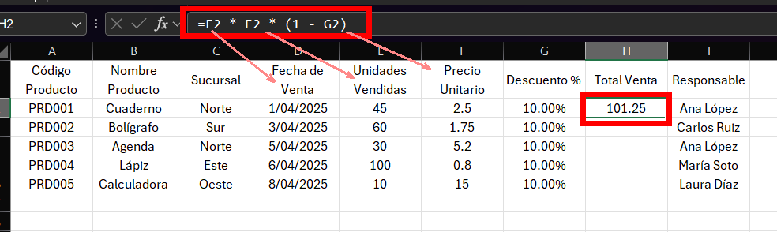

# Práctica 3. Reporte de ventas por sucursal

## Objetivo de la práctica:

Al finalizar esta práctica, el participante será capaz de:
- Manejar filas, columnas, celdas y rangos.
- Aplicar referencias relativas, absolutas y mixtas en fórmulas.
- Usar funciones básicas como `SUMA`, `PROMEDIO`, `MIN` y `MAX`.
- Aplicar funciones de fecha y hora, concatenar, y utilizar funciones para extraer información útil desde una celda.

## Objetivo visual


## Duración aproximada:

- 35 minutos.

## Instrucciones 

### Tarea 1. **Crear la tabla base**

Paso 1. Abrir un nuevo archivo de Excel.

Paso 2. Escribir los siguientes encabezados en la fila 1:

- `Código Producto`
- `Nombre Producto`
- `Sucursal`
- `Fecha de Venta`
- `Unidades Vendidas`
- `Precio Unitario`
- `Total Venta`
- `Responsable`

Paso 3. Ingresar al menos 5 registros de ventas:

| Código Producto | Nombre Producto | Sucursal | Fecha de Venta | Unidades Vendidas | Precio Unitario | Total Venta | Responsable |
|-----------------|------------------|----------|----------------|-------------------|------------------|--------------|-------------|
| PRD001          | Cuaderno         | Norte    | 01/04/2025     | 45                | 2.50             |              | Ana López   |
| PRD002          | Bolígrafo        | Sur      | 03/04/2025     | 60                | 1.75             |              | Carlos Ruiz |
| PRD003          | Agenda           | Norte    | 05/04/2025     | 30                | 5.20             |              | Ana López   |
| PRD004          | Lápiz            | Este     | 06/04/2025     | 100               | 0.80             |              | María Soto  |
| PRD005          | Calculadora      | Oeste    | 08/04/2025     | 10                | 15.00            |              | Laura Díaz  |


### Tarea 2. **Insertar y ocultar columnas**

Paso 4. Dar clic derecho en la columna `Total Venta` y selccionar la opcion de `Insertar` para insertar una nueva columna entre `Precio Unitario` y `Total Venta`, a esta hay que nombrarla como `Descuento %`.


Paso 5. Llenar esa columna con el valor `10%` (usar el formato porcentaje).


Paso 6. Calcular el total de la venta aplicando el descuento, en la columna `Total Venta`:

```excel
=Unidades Vendidas * Precio Unitario * (1 - Descuento %)
```



Paso 7. Usar **referencias mixtas** para que el descuento se aplique correctamente en todas las filas.


Paso 8. Ocultar la columna `Descuento %` para simular datos internos no visibles al público.


### Tarea 3. **Aplicar funciones básicas**

Paso 9. Debajo de la tabla, usar las formulas para calcular lo siguiente:
- Total de unidades vendidas: `SUMA`.


- Promedio de precio unitario: `PROMEDIO`


- Mínimo de unidades vendidas: `MIN`


- Máximo de unidades vendidas: `MAX`


### Tarea 4. **Aplicar funciones de fecha**

Paso 10. Agregar una nueva columna llamada `Días Desde Venta`, usando la función:
```excel
=HOY() - Fecha de Venta
```
Y cambiar el formato a número, lo que mostrará cuántos días han pasado desde la fecha de venta. 


### Tarea 5. **Concatenar información**

Paso 11. Crear una nueva columna llamada `Resumen`, donde combines el código, nombre del producto y sucursal en una sola celda, por ejemplo:

```excel
=CONCAT(Código Producto; " - "; Nombre Producto; " ("; Sucursal; ")")
```


### Tarea 6. **Extraer información de texto**

Paso 12. En una nueva columna `Iniciales`, extraer las dos primeras letras del nombre del producto con la función `IZQUIERDA`:
```excel
=IZQUIERDA(Nombre Producto; 2)
```


### Tarea 7. **Guardar y crear copia**

Paso 13. Guardar el archivo como `Ventas_Sucursales.xlsx`.

Paso 14. Usar `Guardar como` para crear una copia con el nombre `Ventas_Sucursales_v2.xlsx`.


---

### Resultado esperado:


