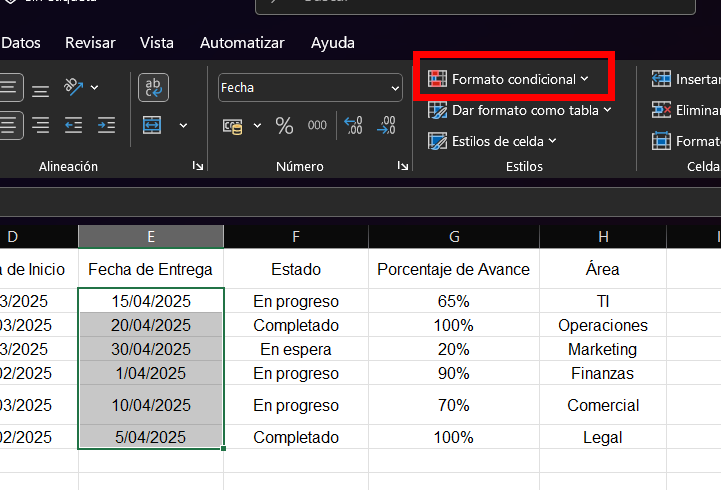
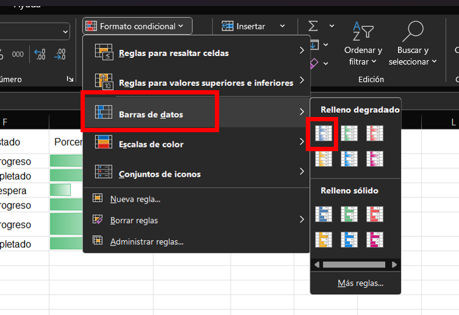
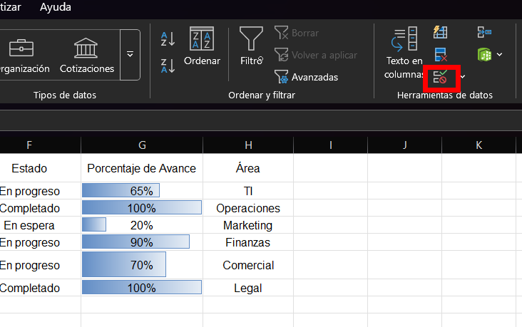

# Práctica 4. Seguimiento de proyectos

## Objetivo de la práctica:

Al finalizar esta práctica, el participante será capaz de:
- Aplicar formato condicional.
- Utilizar listas desplegables, ordenar y filtrar datos, buscar y reemplazar datos incorrectos para consolidar información clave de un conjunto de tareas o proyectos.

## Objetivo visual

## Duración aproximada:
- 35 minutos.

## Instrucciones

### Tarea 1. **Crear la tabla de proyectos**

Paso 1. Abri un nuevo archivo de Excel.

Paso 2. Escribir los siguientes encabezados en la fila 1:

- `ID Proyecto`
- `Nombre del Proyecto`
- `Responsable`
- `Fecha de Inicio`
- `Fecha de Entrega`
- `Estado`
- `Porcentaje de Avance`
- `Área`

Paso 3. Ingresar al 6 registros de proyectos con los siguientes valores:

| ID Proyecto | Nombre del Proyecto | Responsable  | Fecha de Inicio | Fecha de Entrega | Estado       | Porcentaje de Avance | Área         |
|-------------|----------------------|--------------|------------------|------------------|---------------|-----------------------|--------------|
| PRJ001      | Plataforma Web       | Ana Gómez    | 01/03/2025       | 15/04/2025       | En progreso   | 65%                   | TI           |
| PRJ002      | Manual de procesos   | Diego López  | 10/03/2025       | 20/04/2025       | Completado    | 100%                  | Operaciones  |
| PRJ003      | Rediseño Logo        | Laura Méndez | 05/03/2025       | 30/04/2025       | En espera     | 20%                   | Marketing    |
| PRJ004      | Auditoría Interna    | Carlos Ruiz  | 15/02/2025       | 01/04/2025       | En progreso   | 90%                   | Finanzas     |
| PRJ005      | Capacitación Ventas  | Sara Torres  | 18/03/2025       | 10/04/2025       | En progreso   | 70%                   | Comercial    |
| PRJ006      | Revisión Contratos   | Ana Gómez    | 25/02/2025       | 05/04/2025       | Completado    | 100%                  | Legal        |

---

### Tarea 2. **Aplicar formato condicional**

Paso 4. Seleccionar los datos de la columna `Fecha de Entrega` y aplicar el formato condicional seleccionandolo y escogiendo una regla que resalte en **rojo claro** las fechas **anteriores al día de hoy**.

Paso 5. Seleccionar la columna `Porcentaje de Avance` y aplicar una barra de progreso usando el formato condicional tipo **barra de datos**.

---

### Tarea 3. **Listas desplegables**

Paso 6. Seleccionar los datos de la columna `Estado` y dirigirse a la pestaña `Datos`.

Paso 7. Seleccionar la opcion `Validacion de datos`.

Paso 8. Seleccionar la opcion de `lista`, marcar la casilla `Celda con lista desplegable` y dar clic en la opcion de seleccionar celdas.

Paso 9. Seleccionar las celdas encerrando los recuadros: `Completado`, `En espera`, `En progreso` y presiona la tecla **Enter.**

Paso 10. Dar clic en `Aceptar`.

---

### Tarea 4. **Filtrar**

Paso 11. Seleccionar el recuadro de `Estado` y en la pestaña de `datos` dar clic en el `filtro`.

Paso 12. Filtrar la tabla para mostrar **solo los proyectos "En progreso".**

---

### Tarea 5. **Buscar y reemplazar**

Paso 13. Buscar el nombre `Carlos Ruiz` en toda la hoja y reemplazarlo por `Carlos R.` usando la función **Buscar y Reemplazar (Ctrl + L o Ctrl + B).**

---

### Tarea 6. **Guardar y crear copia**

Paso 14. Guardar el archivo como `Seguimiento_Proyectos.xlsx`.

Paso 15. Usar `Guardar como` para crear una copia con el nombre `Seguimiento_Proyectos_v2.xlsx`.

---

### Resultado esperado:

