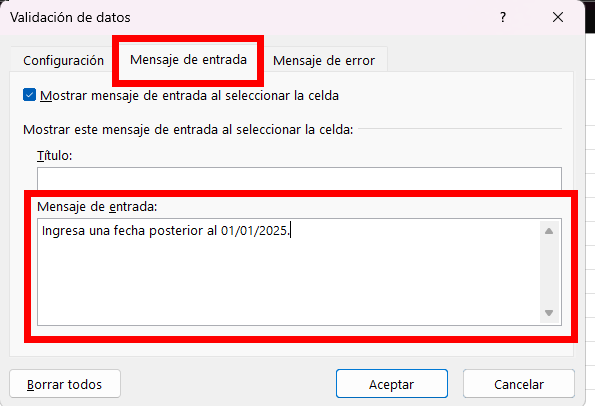
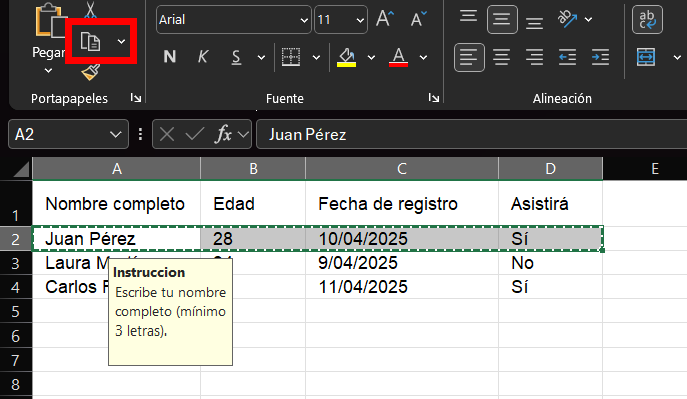

# Práctica 5. Registro de asistencia a evento

## Objetivo de la práctica:

Al finalizar esta práctica, el participante será capaz de:
- Aplicar validaciones de datos en celdas para restringir valores de texto, números y fechas.
- Mostrar mensajes de entrada y advertencias personalizadas.
- Aplicar validación a rangos múltiples, así como revisar y eliminar reglas de validación.

## Objetivo visual

## Duración aproximada:
- 30 minutos.

## Instrucciones

### Tarea 1. **Crear tabla de registro**

Paso 1. Abrir un nuevo archivo de Excel y crear una hoja con los siguientes encabezados:

- Nombre completo  
- Edad  
- Fecha de registro  
- Asistirá  

Paso 2. Llenar una fila de ejemplo para tener una vista preliminar de los datos:

| Nombre completo | Edad | Fecha de registro | Asistirá |
|------------------|------|--------------------|----------|
| Juan Pérez       | 28   | 10/04/2025         | Sí       |

---

### Tarea 2. **Validar nombre (solo texto)**

Paso 3. Seleccionar el dato en la columna `Nombre completo`.

Paso 4. Dirigirse a `Datos > Validación de datos`.

Paso 5. Seleccionar "Longitud de texto" y permitir entre 3 y 40 caracteres.  
✔ Esto evitará nombres demasiado cortos o vacíos.

Paso 6. En la pestaña "Mensaje de entrada", escribir:  
- **Título:** Instrucción  
- **Mensaje:** Escribe tu nombre completo (mínimo 3 letras).

Paso 7. En la pestaña "Mensaje de error":  
- Tipo: Advertencia  
- Mensaje: Revisar el nombre ingresado, debe tener al menos 3 caracteres.

---

### Tarea 3. **Validar edad (entre 18 y 60 años)**

Paso 8. Seleccionar la columna `Edad`.

Paso 9. En Validación de datos, seleccionar:  
- Tipo: Número entero  
- Mínimo: 18  
- Máximo: 60

Paso 10. Mensaje de entrada:  
- **Mensaje:** Edad permitida entre 18 y 60 años.

Paso 11. Mensaje de error:  
- Tipo: Detener  
- **Mensaje:** Solo se permite ingresar edades válidas para el evento.

---

### Tarea 4. **Validar fecha (a partir del 01/01/2025)**

Paso 12. Seleccionar el dato de la columna `Fecha de registro`.

Paso 13. Tipo de validación: Fecha  
- Datos: mayor o igual que  
- Fecha de inicio: 01/01/2025

Paso 14. Mensaje de entrada:  
- **Mensaje:** Ingresar una fecha posterior al 01/01/2025.

Paso 15. Mensaje de error:  
- Tipo: Advertencia  
- **Mensaje:** La fecha ingresada no es válida para este evento.

---

### Tarea 5. **Copiar validaciones a múltiples filas**

Paso 19. Llenar el resto de filas con la siguiente información.

| Nombre completo  | Edad | Fecha de registro | Asistirá |
|------------------|------|-------------------|----------|
| Juan Pérez       | 28   | 10/04/2025        | Sí       |
| Laura Martínez   | 34   | 09/04/2025        | No       |
| Carlos Ramírez   | 22   | 11/04/2025        | Sí       |

Paso 20. Seleccionar la fila con las validaciones ya aplicadas y copiar.

Paso 21. Seleccionar los datos a los cuales se les va a aplicar las validaciones anteriormente creadas, dar clic derecho y seleccionar `Pegado especial`.

Paso 22. Seleccionar la opción de `Validacion` y dar clic en `Aceptar`.

---

### Tarea 6. **Ver y eliminar validaciones**

Paso 23. Seleccionar los datos de `Edad` y dirigirse a `Datos > Validación de datos`.

Paso 24. Eliminar la validación seleccionando `Borrar todos` y luego `Aceptar`.

---

### Resultado esperado:

