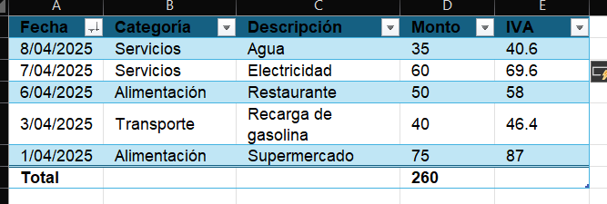

# Práctica 6. Control de gastos personales

## Objetivo de la práctica:

Al finalizar esta práctica, el participante será capaz de:
- Crear y dar formato a una tabla en Excel.
- Aplicar estilos visuales, insertar y eliminar filas, utilizar nombres estructurados para cálculos, así como ordenar y filtrar los datos de manera eficiente.

## Objetivo visual


## Duración aproximada:
- 30 minutos.

## Instrucciones

### Tarea 1. **Crear una tabla desde cero**

Paso 1. Abrir un nuevo archivo de Excel y crear una hoja llamada `Gastos`.

Paso 2. En la fila 1, escribir los siguientes encabezados:

- Fecha  
- Categoría  
- Descripción  
- Monto  

Paso 3. Llenar 5 filas con los siguientes datos:

| Fecha      | Categoría     | Descripción       | Monto |
|------------|----------------|--------------------|--------|
| 01/04/2025 | Alimentación   | Supermercado       | 75     |
| 03/04/2025 | Transporte     | Recarga de gasolina| 40     |
| 05/04/2025 | Entretenimiento| Cine               | 20     |
| 06/04/2025 | Alimentación   | Restaurante        | 50     |
| 07/04/2025 | Servicios      | Electricidad       | 60     |

---


### Tarea 2. **Convertir el rango en tabla**

Paso 4. Seleccionar los datos con sus encabezados.

Paso 5. Dirigirse a `Insertar > Tabla`. Asegúrate de que esté marcada la opción `La tabla tiene encabezados`.


Paso 6. Seleccionar la tabla, y desde la pestaña `Diseño de tabla`, cambiar el nombre de la tabla a `tblGastos` 


---

### Tarea 3. **Aplicar estilo y diseño**

Paso 7. Desde la pestaña `Diseño de tabla`, seleccionar un estilo visual que diferencie encabezados y filas alternas.


Paso 8. Activar las siguientes opciones:  

✔ Fila de encabezado  
✔ Fila de totales  
✔ Fila con bandas


---

### Tarea 4. **Insertar una nueva fila y eliminar otra**

Paso 9. En la parte inferior de la tabla, insertar una nueva columna que tenga los siguientes gastos:  

- Fecha: 08/04/2025  
- Categoría: Servicios  
- Descripción: Agua  
- Monto: 35

| Fecha      | Categoría     | Descripción       | Monto |
|------------|----------------|--------------------|--------|
| 08/04/2025  | Servicios   |      Agua       | 35     |


Paso 10. Eliminar la fila que contiene el gasto en el cine, en la categroia "Entretenimiento", y observar como se ajusta el total.


---

### Tarea 5. **Ordenar y filtrar los datos**

Paso 11. Seleccionar la flecha de filtro, y para ordenar la tabla por fecha, seleccionar `Ordenar de más reciente a más antiguos`.


Paso 12. Aplicar un filtro para mostrar solo los gastos de la categoría "Alimentación".


---

### Tarea 6. **Utilizar fórmulas con nombres estructurados**

Paso 13. Agregar una nueva columna a la derecha con el encabezado `Monto con IVA`.

Paso 14. En la primera celda de esa columna, escribir la siguiente fórmula usando referencias estructuradas:

```excel
=[@Monto]*1.16
```

Paso 15. Presionar Enter y verificar que se haya aplicado a toda la columna.


---

### Tarea 7. **Guardar el archivo**

Paso 16. Guardar el archivo como `Control_Gastos.xlsx`.

Paso 17. Usar `Guardar como` para crear una copia: `Control_Gastos_v2.xlsx`.

---

### Resultado esperado:


