# Explorando Copilot con un Archivo de Ventas

## Objetivo de la práctica:

Al finalizar esta práctica, el participante será capaz de activar y utilizar Copilot en Excel para generar fórmulas automáticas, completar datos, recibir recomendaciones de gráficos, y aplicar formato visual de forma asistida, integrando sus funciones básicas en un flujo de trabajo real.

## Objetivo Visual

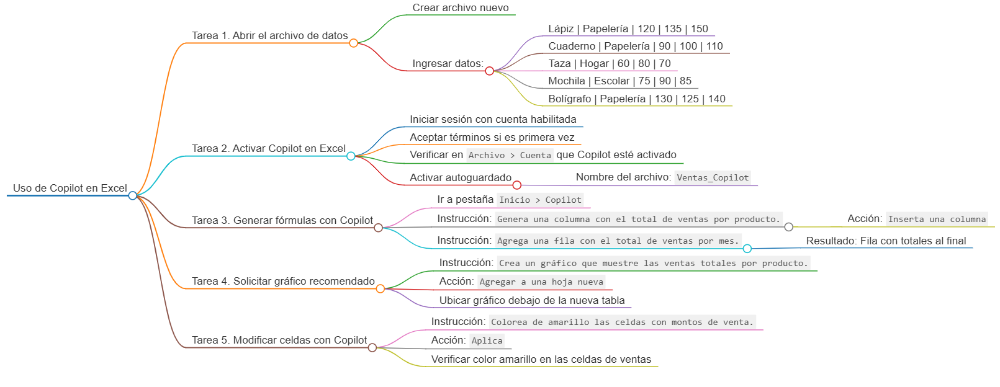

## Duración aproximada:
- 30 minutos.

## Instrucciones

### Tarea 1. **Abrir el archivo de datos**

Paso 1. Abre un nuevo archivo de Excel y coloca los siguientes datos:

| Producto   | Categoría   | Enero | Febrero | Marzo |
|------------|-------------|--------|----------|--------|
| Lápiz      | Papelería   | 120    | 135      | 150    |
| Cuaderno   | Papelería   | 90     | 100      | 110    |
| Taza       | Hogar       | 60     | 80       | 70     |
| Mochila    | Escolar     | 75     | 90       | 85     |
| Bolígrafo  | Papelería   | 130    | 125      | 140    |

---

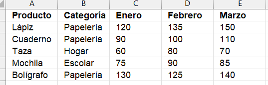

### Tarea 2. **Activar Copilot en Excel**

Paso 2. Inicia sesión con una cuenta habilitada para Copilot. Si es la primera vez, acepta los términos para comenzar.

Paso 3. Ve a la pestaña `Archivo`, luego busca `Cuenta` y debe aparecer el logo de Copilot, lo que indicaria que esta activado.

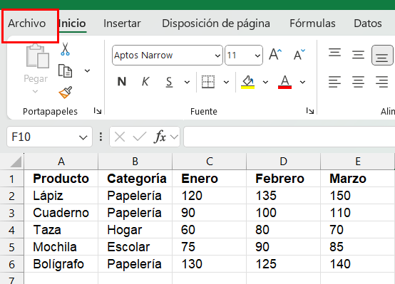
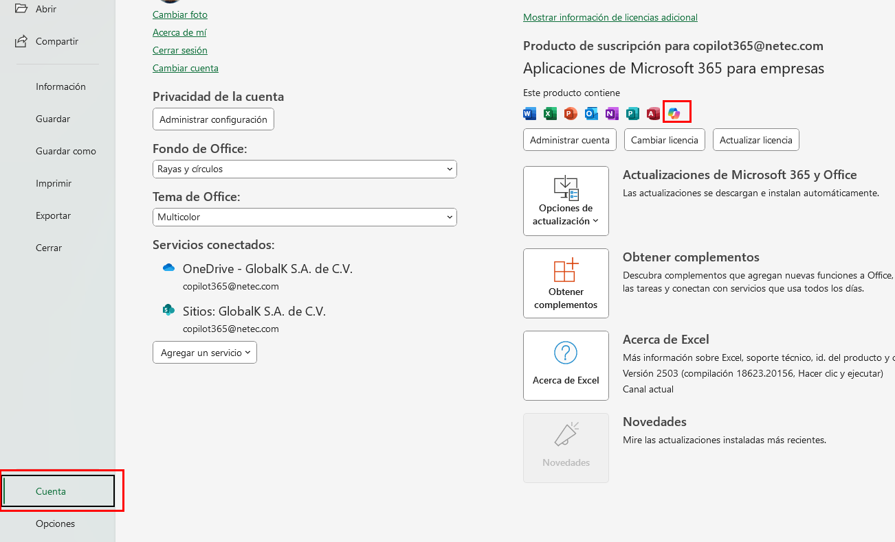

Paso 4. Activa el autoguardado del documento, colocando el nombre `Ventas_Copilot`.

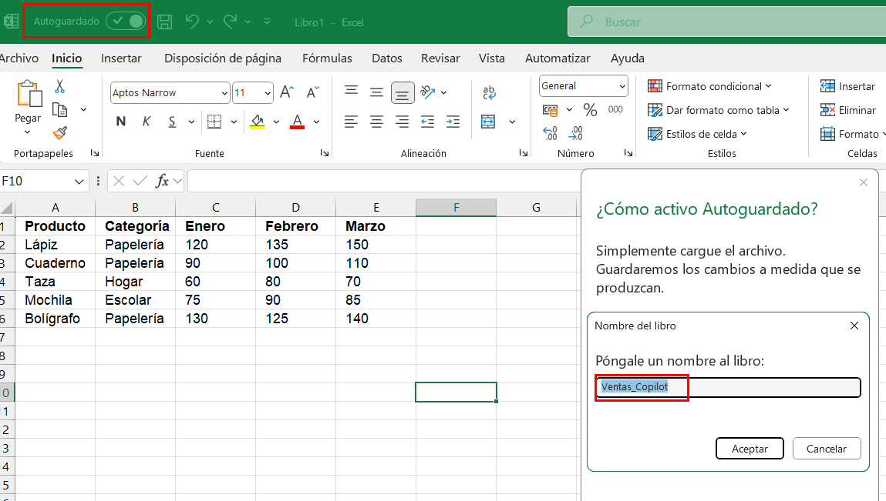

---

### Tarea 3. **Solicitar generación de fórmulas automáticas**

Paso 5. En `Inicio`, selecciona la opcion de `Copilot`, y escribe en Copilot:  
`Genera una columna con el total de ventas por producto.`, y selecciona `Inserta una columna`.

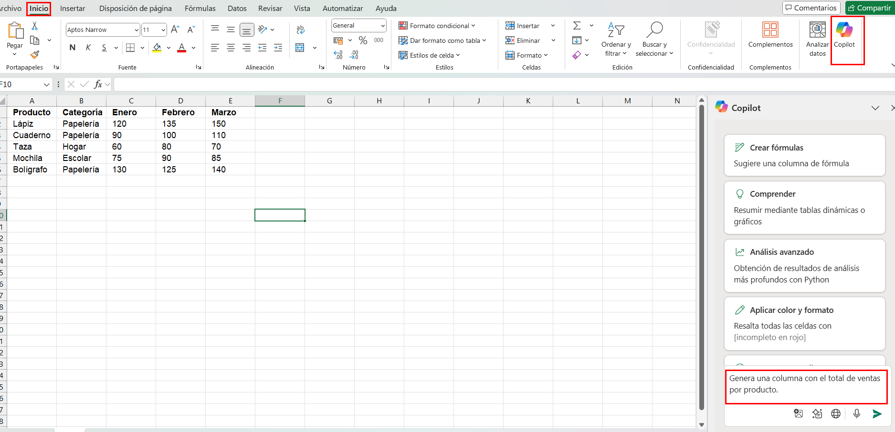
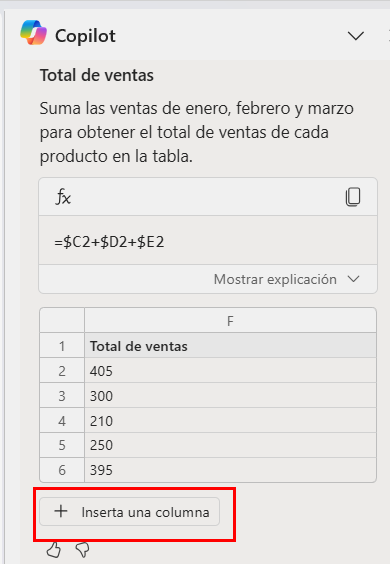

Paso 6. Ahora solicita:  
`Agrega una fila con el total de ventas por mes.`

Paso 7. Observa que Copilot agrega una fila al final con los totales de cada columna.

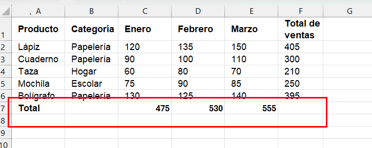

---

### Tarea 4. **Solicitar un gráfico recomendado**

Paso 8. Escribe en Copilot `Crea un gráfico que muestre las ventas totales por producto.`
Y selecciona `Agregar a una hoja nueva`.

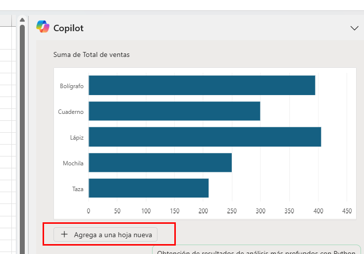

Paso 9. Ajusta su posición debajo de la nueva tabla.

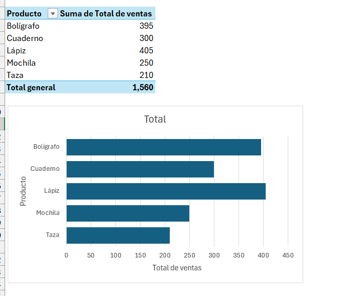

---

### Tarea 5. **Modificar celdas con Copilot**

Paso 10. Selecciona los datos y escribe en Copilot:  
`Colorea de amarillo las celdas con montos de venta.` luego selecciona `Aplica`.

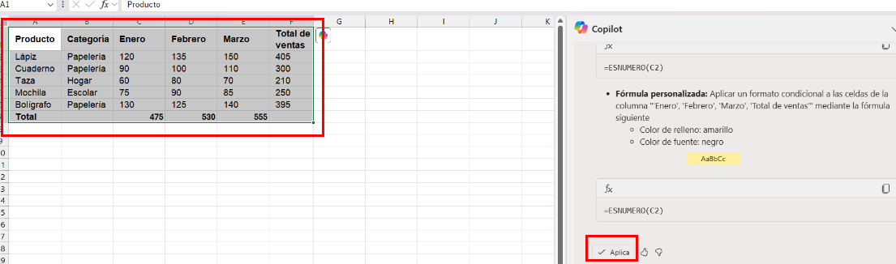

Paso 12. Verifica que Copilot aplique el color a los valores.

---

### Resultado esperado:

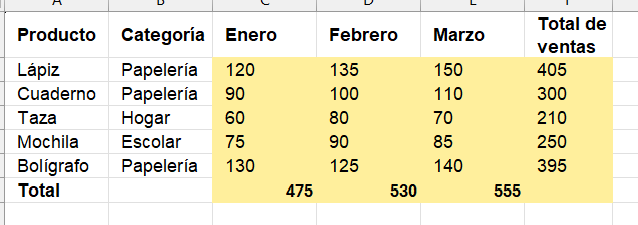
